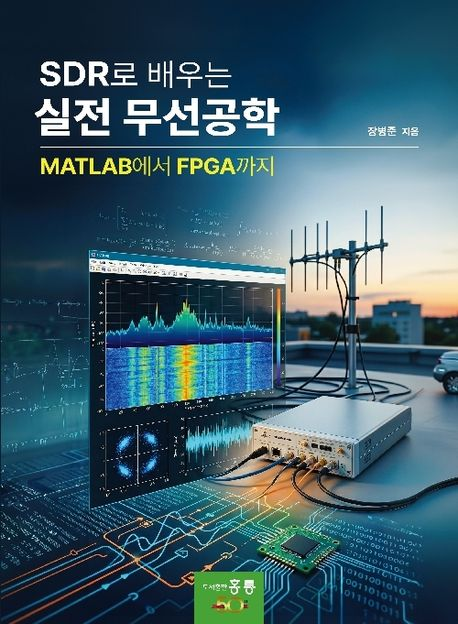

# HDL Coder Evaluation Reference Guide 예제 자료

이 레포지토리는 **HDL Coder Evaluation Reference Guide** 책에서 다루는 MATLAB, Simulink, HDL Coder, SDR, PYNQ 데모 예제 자료를 장별로 정리한 공간입니다. 각 장의 스크립트, Simulink 모델, 오디오 입력 파일, 데모 노트북과 FPGA 실행 파일을 책의 흐름에 맞춰 보관합니다.

책의 일부 내용은 [샘플 페이지 PDF](docs/sample_page.pdf)에서 확인할 수 있습니다.

## 구성

| 경로 | 내용 |
| --- | --- |
| `Chapter_2/` | FIR 필터, rate conversion, decimator, HDL 친화적 오디오 처리 예제 |
| `Chapter_3/` | DSB, QAM, FM 변복조 모델과 Simulink 기반 통신 시스템 예제 |
| `Chapter_4/` | PlutoSDR, RTL-SDR 연동 모델과 스펙트럼 분석, 루프백 예제 |
| `Chapter_5/` | HDL Coder 기반 FM 수신기 모델 생성, 검증, 고정소수점/HDL 변환 예제 |
| `Chapter_5/Demo/` | MATLAB/Simulink 데모, PYNQ 노트북, FPGA 실행용 `demo.bit`, `demo.hwh`, `demo.tcl` |
| `image/` | 책 커버 이미지 |
| `docs/` | 책 샘플 페이지 PDF |

## 주요 예제

- MATLAB 스크립트로 FIR/decimator/HDL FM 수신기 모델 생성
- Simulink 모델을 이용한 DSB, QAM, FM 변조 및 수신 구조 실습
- PlutoSDR와 RTL-SDR 기반 송수신 및 스펙트럼 분석 실습
- HDL Coder를 이용한 FM 라디오 수신기 구조 개선, 고정소수점화, HDL 생성 흐름
- PYNQ 환경에서 실행할 수 있는 FM receiver 데모 노트북과 FPGA bitstream

## 사용 방법

1. MATLAB에서 이 레포지토리 루트 또는 원하는 장의 폴더를 작업 폴더로 엽니다.
2. 장별 MATLAB 스크립트(`*.m`)를 실행하거나 Simulink 모델(`*.slx`)을 엽니다.
3. `Chapter_5/Demo/matlab/`의 Live Script(`*.mlx`)로 FM 수신기 모델 버전별 시뮬레이션을 확인합니다.
4. PYNQ 데모는 `Chapter_5/Demo/pynq/fm_receiver_demo.ipynb`와 `Chapter_5/Demo/hardware/`의 `demo.bit`, `demo.hwh`, `demo.tcl`을 함께 사용합니다.

## 필요 환경

- MATLAB 및 Simulink
- HDL Coder
- Fixed-Point Designer
- DSP System Toolbox
- Communications Toolbox
- SDR 실습 시 PlutoSDR 또는 RTL-SDR 지원 패키지
- PYNQ 데모 실행 시 PYNQ 보드와 Jupyter Notebook 환경

사용하는 장과 예제에 따라 필요한 툴박스와 하드웨어가 달라질 수 있습니다.

## Git 관리 기준

예제 원본(`*.m`, `*.slx`, `*.mlx`, `*.wav`, `*.ipynb`)과 책 소개 자료(`image/`, `docs/`), 데모 실행에 필요한 `Chapter_5/Demo/hardware/` 파일은 추적 대상입니다.

MATLAB/Simulink 캐시(`*.slxc`, `slprj/`), HDL Coder 생성 결과(`hdl_prj/`, `hdlsrc/`), Vivado 프로젝트 출력(`vivado_prj/`, `.Xil/`, `*.jou`, `*.log`)은 재생성 가능한 산출물이므로 `.gitignore`에서 제외합니다.

## 라이선스

예제 자료의 저작권과 사용 조건은 원 책 및 원 배포처의 라이선스 정책을 따릅니다.
